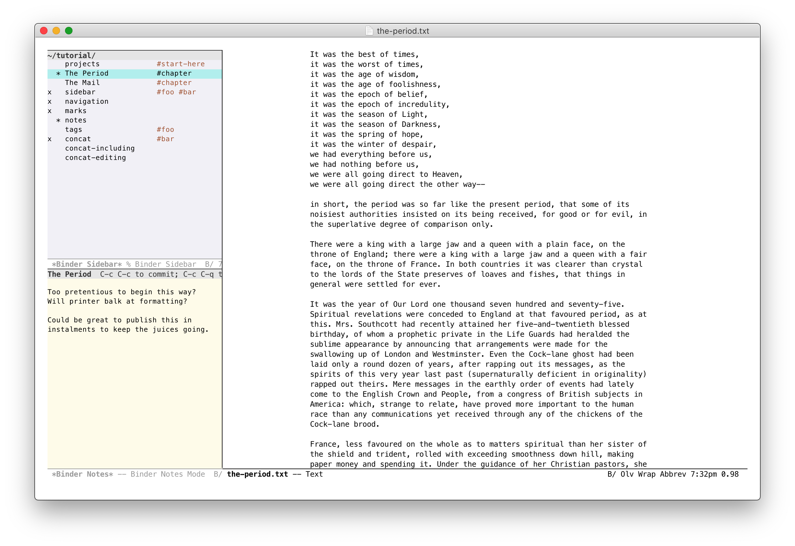

Binder
======

[][1]
[][2]

Binder is global minor mode to facilitate working on a writing project
in multiple files. It is heavily inspired by the binder feature in the
[macOS writing app Scrivener][3].

The rationale behind working this way is to split a large writing
project into smaller pieces.

Features
--------

Primarily, Binder provides a global minor mode `binder-mode`. This
allows working with files in the current `binder-project-directory`.
Data concerning these files is saved in a `.binder.el` file in the
project directory.

A project can be thought of an ordered list of files with the following
associated data:

-  item notes (see **Notes** below)
-  item tags (see **Tags** below)
-  item include state (see **Concatenating** below)

Navigation
----------

At the most basic level, you can navigate back and forth through the
files in a project:

-  `binder-next (C-c ])` visits the next file in the project
-  `binder-previous (C-c [)` visits the previous

Calling these commands activates a transient map so that each command
can be repeated without the prefix key.

Sidebar
-------

You'll mostly interact with the project structure via the sidebar.

-  `binder-toggle-sidebar (C-c ')` toggles the visibility of the binder
   sidebar
-  `binder-reveal-in-sidebar (C-c ;)` finds the current file in the
   sidebar

Each project item is a file reference relative to the project directory.

Project items are displayed in a linear ordered list. Calling
`binder-sidebar-find-file (RET)` or `binder-sidebar-find-file-other-window (o)`
will visit the corresponding file.

Each item in the sidebar displays the following information:

 1. `x` -- denotes that this item is included when concatenating the
    project (see **Concatenating** below)
 2. `*` -- denotes that this item has some notes (see **Notes** below),
    or...
 3. `?` -- denotes that the item's corresponding file cannot be found
 4. `name` -- either the file relative to the project directory or an
    arbitrary display name
 5. `#tag1 #tag2 ...` -- arbitrary item tags (see **Tags** below)

An item's display name can be changed with `binder-sidebar-rename (r)`.
If a file cannot be found, relocate with `binder-sidebar-relocate (R)`.

Calling `binder-sidebar-find-file (RET)` will visit the corresponding
file.

To add an existing file, call `binder-sidebar-add-file (a)` or add all
files in directory with `binder-sidebar-add-all-files (A)`.

Add a new file with `binder-sidebar-new-file (M-RET)`. This prompts for a
file-name and adds this (possibly non-existent) file to the project
after the current file's index. If no file-name extension is provided,
use `binder-default-file-extension`.

>  Hint: you can use an alternate default file extension for different
>  projects by setting a directory local variable.

Files can also be added to a project from outside the sidebar with
`binder-add-file (C-c :)`.

Items can be reordered with `binder-sidebar-shift-up (M-p | M-up)` and
`binder-sidebar-shift-down (M-n | M-down)`.

Remove items with `binder-sidebar-remove (d)` -- this *does not delete
the files*, only removes them from the project, but it *does* delete the
corresponding notes and tags.

Hide item file extensions by setting the `binder-sidebar-hide-file-extensions`
option. This can be toggled with `binder-sidebar-toggle-file-extensions (E)`.

The sidebar can be resized with `binder-sidebar-shrink-window ({)` and
`binder-sidebar-enlarge-window (})`. The window size is changed by the
number of columns specified in option `binder-sidebar-resize-window-step`.

You can customize how the sidebar window is displayed by setting
`binder-sidebar-display-alist` option.

Notes
-----

To open the notes buffer from the sidebar, call either
`binder-sidebar-open-notes (z)` to open and select the notes window, or
`binder-sidebar-toggle-notes (i)` to toggle the window.

To open a project file's notes from outside the sidebar, call
`binder-toggle-notes (C-c ")`.

You need to call either `binder-notes-save (C-x C-s)` or
`binder-notes-save-and-quit-window (C-c C-c)` to save notes to the
project file.

Calling `quit-window (C-c C-q | C-c C-k)` or `binder-toggle-sidebar`
does not save notes.

You can embiggen the notes window, to pop it out from the sidebar and
edit like a regular buffer window, with `binder-notes-expand-window (C-c
C-l)`.

You can customize how the notes window is displayed by setting
`binder-notes-display-alist` option.

Tags
----

Tags can help organize a project. An item can have any number of tags.

Add a tag to an item with `binder-sidebar-add-tag (t)`. Remove a tag
from an item with `binder-sidebar-remove-tag (T)`. You can tag/untag
multiple items at once by using marks (see **Marking** below).

Items in the sidebar can be narrowed to only show items with a certain
tag with `binder-sidebar-narrow-by-tag (/)` and/or only show items
without a certain tag with `binder-sidebar-exclude-by-tag (\)`. Each of
these commands can be called multiple times with additional tags.

Clear the sidebar filters with `binder-sidebar-clear-filters (|)`.

Marking
-------

Multiple items can be marked to add tags, toggle include state or
delete. Call `binder-sidebar-mark (m)` to mark an item or
`binder-sidebar-unmark (u)` to unmark an item.

To unmark all sidebar items, call `binder-sidebar-unmark-all (U)`.

Concatenating
-------------

A writing project in discrete pieces probably has an end goal of being
put together. Each project item has a property of being "included" or
not. In the sidebar, an item's include state is toggled with
`binder-sidebar-toggle-include (x)`.

When calling `binder-sidebar-concat (c | v)`, project items marked as
included will be concatenated in a new buffer. The default mode of this
buffer is set by `binder-default-concat-mode`.

>  Hint: you can use an alternate default mode for different projects by
>  setting a directory local variable.

When in the `*Binder Concat View*` buffer, calling
`binder-concat-find-original (C-c RET)` will visit the original file
corresponding to the text at point.

Requirements
------------

-  Emacs 24.4
-  seq 2.20 (part of Emacs 25 and later)

Installation
------------

The latest stable release of Binder is available via [MELPA-stable][1].
First, add MELPA-stable to your package archives:

    M-x customize-option RET package-archives RET
    
Insert an entry named `melpa-stable` with URL:
https://stable.melpa.org/packages/

You can then find the latest stable version of `binder` in the list
returned by:

    M-x list-packages RET

If you prefer the latest but perhaps unstable version, do the above
using [MELPA][2].

Advanced Installation
---------------------

Download the latest tagged release, move this file into your `load-path`
and add to your `init.el` file:

    (require 'binder)
    (require 'binder-tutorial)  ;; optional

If you wish to contribute to or alter Binder's code, clone the
repository into your load-path and require as above:

    git clone https://github.com/rnkn/binder.git

Bugs and Feature Requests
-------------------------

Send me an email (address in the package header). For bugs, please
ensure you can reproduce with:

    $ emacs -Q -l binder.el

Known issues are tracked with `FIXME` comments in the source.

Tutorial
--------

Binder comes with a tutorial. Calling `M-x binder-tutorial` will prompt
for an empty directory in which to generate the tutorial files.

[1]: https://stable.melpa.org/#/binder
[2]: https://melpa.org/#/binder
[3]: https://www.literatureandlatte.com/scrivener/
